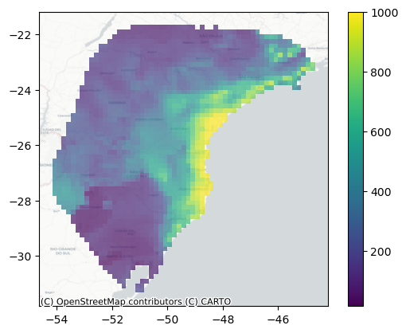

# *spaceprime*


[](https://pypi.python.org/pypi/spaceprime)

**A python package to facilitate spatially explicit coalescent modeling
in *msprime***

- Free software: MIT License
- Documentation: <https://connor-french.github.io/spaceprime>

## *Overview*

*spaceprime* is a Python package that facilitates the use of **spatially
explicit coalescent modeling** in the *msprime* library. The package is
designed to make it easier for practitioners to **convert spatial maps
of habitat suitability into extensible two-dimensional stepping-stone
models of gene flow**, where each pixel of the map represents a deme and
demes are able to migrate with their neighbors. Demes and migration
rates are able to change over time according to habitat suitability
model projections to different time periods. These demographic
parameters are then used to simulate genetic data under a coalescent
model with *msprime* as the simulator, which can be used to infer the
demographic history of the population. The package is designed to be
**user-friendly and intuitive**, allowing users to easily simulate and
analyze spatially explicit genetic data.

This page provides an overview of the package and its main features. For
more detailed information, please refer to the
[documentation](https://connor-french.github.io/spaceprime).

**Note for R users**: *spaceprime* is coded in Python, yet many
interested users may come from an R background. I have a [*spaceprime*
for R users]() vignette (COMING SOON) that provides a brief introduction
to the Python concepts necessary to use *spaceprime* in a practical
walk-through of an example analysis. Additionally, it is possible to use
Python code in R using the *reticulate* package. For more information on
how to use Python code in R, see the [reticulate
documentation](https://rstudio.github.io/reticulate/).

## Main features

*spaceprime* includes a number of features: - **Convert habitat
suitability values into demographic parameters**, including deme sizes,
migration rates, and their change through time using **very little
code**. Code complexity does not increase with model complexity,
allowing users to focus on the biological questions they are interested
in. - Simulate spatially explicit genetic data under a coalescent model
with *msprime*. The modeling approach is **fully coalescent** with no
forward-time component, allowing for **computationally efficient
simulations** of large spatially explicit models. - Visualize
demographic models to facilitate model interpretation and model
checking. - Compute genetic summary statistics for simulated and
empirical data to facilitate comparison with empirical data.  
- Extensibility: *spaceprime* is designed to be interoperable with
*msprime*, where users can setup a model with *spaceprime*, then
customize it using the full range of *msprime* functionality.

## Installation

### Stable release

*spaceprime* can be installed using `pip` or `conda`. Due to the
package’s reliance on `msprime`, the `pip` installation is only
available on unix-based systems (MacOS, Linux). Windows users should
install *spaceprime* using `conda`.

To install *spaceprime* using `pip`, run the following command in your
terminal:

``` {bash}
pip install spaceprime
```

To install *spaceprime* using `conda`, run the following command in your
terminal:

``` {bash}
conda install -c conda-forge spaceprime
```

The `mamba` package manager can also be used to install *spaceprime*
using `conda`. `mamba` tends to be much faster than conda. To install
*spaceprime* using `mamba`, install `mamba`, then run the following
command in your terminal:

``` {bash}
mamba install -c conda-forge spaceprime
```

### From source

To install spaceprime from source, run this command in your terminal:

``` {bash}
pip install git+https://github.com/connor-french/spaceprime
```

### Extras

To install the `analysis` module, which is imported separately from the
main package to reduce the number of dependencies:

``` {bash}
pip install spaceprime[analysis]
```

or

``` {bash}
conda install -c conda-forge spaceprime[analysis]
```

## Usage

To use spaceprime in a project:

``` python
import spaceprime
```

To use the `analysis` module, which is imported separately from the main
package to reduce the number of dependencies:

``` python
from spaceprime import analysis
```

> \[!IMPORTANT\] Make sure to install the relevant analysis dependencies
> with `pip install spaceprime[analysis]` or
> `conda install -c conda-forge spaceprime[analysis]`.

## Quickstart

> \[!NOTE\] This quickstart guide assumes you have a basic understanding
> of Python. If you are an R user, please refer to the [spaceprime for R
> Users vignette](https://connor-french.github.io/spaceprime) for an
> overview of *spaceprime* with the necessary Python concepts explained.

### 1. Download data

The data we’re using in this example are a
[GeoTiff](https://en.wikipedia.org/wiki/GeoTIFF) raster file of habitat
suitability values and a [GeoJSON](https://geojson.org/) file containing
geographic localities and metadata for this cute frog, *Phyllomedusa
distincta*:


Follow the link to download the [projections.tif
file](https://github.com/connor-french/spaceprime/raw/main/spaceprime/data/projections.tif).
You do not need to download the
[localities.geojson](https://raw.githubusercontent.com/connor-french/spaceprime/main/spaceprime/data/localities.geojson)
file, as it is read in from the web in the code below.

The raster file contains 23 layers, where each layer is a projection of
the [habitat suitability model (aka species distribution model or
ecological niche
model)](https://en.wikipedia.org/wiki/Species_distribution_modelling) to
a time slice in the past, ranging from the present day to 22,000 years
ago in 1,000 year intervals. The habitat suitability values range from
zero to one, where zero represents no suitability for the species and
one represents perfect suitability. In the following plots, **yellow
represents higher suitability and purple represents lower suitability**.
Here are a few time slices of the model:


The GeoJSON file contains geographic localities of *P. distincta* in the
Brazilian Atlantic Forest, along with metadata about each locality. Here
are the localities plotted on top of the present-day habitat suitability
model:


### 2. Read in packages and data

Now that we have our data, let’s read in the packages and data we’ll be
using. Make sure to replace the `projections.tif` file path with the
path to the file on your system:

``` python
import spaceprime as sp
import geopandas as gpd
import rasterio


r = rasterio.open("projections.tif")
locs = gpd.read_file("https://raw.githubusercontent.com/connor-french/spaceprime/main/spaceprime/data/localities.geojson")
```

### 3. Set up the demographic model

Next, we’ll convert the habitat suitability values into deme sizes, so
each cell in the raster will represent a deme in our model. We’ll use a
linear transformation to convert the suitability values to deme sizes,
where the suitability value is multiplied by a constant to get the deme
size. The constant is the maximum local deme size, which we set to 1000.
For more on transformations, see the [suitability to deme size
transformation functions vignette](trans-fns.md).

``` python
d = sp.raster_to_demes(r, transformation="linear", max_local_size=1000)
```

Now that we have our deme sizes, we can set up the demographic model.
The model that *spaceprime* uses is a two-dimensional stepping-stone
model with a global migration rate of 0.001 between neighboring demes.
The global rate by default is scaled, where demes exchange the same
number of migrants with their neighbors, regardless of deme size. To
change this behavior, set `scale=false`. Using a single value for the
`timesteps` argument tells spaceprime that 1000 generations passes in
between each raster time step in the model, which we are assuming here.
This step may take a few seconds (10-15 seconds on my machine) to run.

``` python
# initialize the model
demo = sp.spDemography()

# populate the spDemography object with the deme sizes and migration rates
demo.stepping_stone_2d(d, rate=0.001, timesteps=1000)
```

After initializing the spatial component of the simulation, it’s
desirable to add one or more ancestral populations to the model. This is
done by providing a list of ancestral population sizes and the time (in
generations) at which the spatially distributed demes migrate into the
ancestral population(s). The following code adds a single ancestral
population of 100,000 individuals that demes merge into 23,000
generations in the past:

``` python
# add ancestral population
demo.add_ancestral_populations([100000], 23000)
```

### 4. Inspect your model

Now that we have our demographic model set up, we can inspect it to make
sure it looks as expected. *spaceprime* has a series of `plot_()`
functions that make this easier.

#### `plot_landscape()`

`plot_landscape()` plots the deme sizes in space, which allows you to
quickly inspect whether the transformation you applied to your habitat
suitability map make sense. Here, we provide the demographic model
object, the raster object, the index of the time slice to plot (0 for
the present day in this case), and `basemap=True` to add an
[OpenStreetMap](https://www.openstreetmap.org/) basemap, providing
geographic context to the plot. If you don’t have an internet
connection, set `basemap=False` (the default) to plot without the
basemap.

``` python
sp.plot_landscape(demo, r, 0, basemap=True)
```



#### `plot_model()`

`plot_model()` plots the deme sizes on a
[folium](https://python-visualization.github.io/folium/latest/index.html)
interactive map, with precise deme sizes and outgoing migration rates
for each deme present in a popup. *Note*- the below is rendered as an
image, but the actual plot is interactive.

``` python
sp.plot_model(demo, r, 0)
```

### 4. Simulate genetic data

Before simulating this demography, we need to create a sample dictionary
that translates the empirical sampling localities to the model’s deme
indices and maps those to the number of samples to take from each deme.
By default, this function sets the number of individuals to sample from
each deme to the number of empirical localities in that deme. The
`coords_to_sample_dict()` function also returns two other dictionaries
that are not used in this example, so we’ll ignore them.

``` python
sample_dict, _, _ = sp.coords_to_sample_dict(r, locs)
```

Now we get to simulate! The first task is to simulate the ancestry of
the samples using the coalescent. All of the hard work is done through
`msprime`’s `sim_ancestry()` function, for which `spaceprime` provides a
convenience wrapper. This function returns a \[tskit
TreeSequence(https://tskit.dev/tskit/docs/stable/python-api.html#trees-and-tree-sequences),
which “represents a sequence of correlated evolutionary trees along a
genome” and is and incredibly powerful and compact data representation
for population genomic analyses. The minimum number of arguments
required for this function are the sample dictionary and the demographic
model. The sequence length is also necessary for overlaying mutations in
the next step. We’ll set `record_provenance` to False to decrease the
memory overhead of storing a bunch of metadata about the simulation.

This step may take a minute or so to run.

``` python
sim = sp.sim_ancestry(samples=sample_dict, demography=demo, sequence_length=1e5, record_provenance=False, random_seed=42)

sim
```

            <div>
              <style>
                .tskit-table thead tr th {text-align: left;padding: 0.5em 0.5em;}
                .tskit-table tbody tr td {padding: 0.5em 0.5em;}
                .tskit-table tbody tr td:first-of-type {text-align: left;}
                .tskit-details-label {vertical-align: top; padding-right:5px;}
                .tskit-table-set {display: inline-flex;flex-wrap: wrap;margin: -12px 0 0 -12px;width: calc(100% + 12px);}
                .tskit-table-set-table {margin: 12px 0 0 12px;}
                details {display: inline-block;}
                summary {cursor: pointer; outline: 0; display: list-item;}
              </style>
              <div class="tskit-table-set">
                <div class="tskit-table-set-table">
                  &#10;
|  <a              
 href="https://tskit.dev/tskit/docs/latest/python-api.html#the-treesequence-class"     
 target="_blank">Tree Sequence</a>                                                     |             |
|--------------------------------------------------------------------------------------|-------------|
| Trees                                                                                | 1           |
| Sequence Length                                                                      | 100000.0    |
| Time Units                                                                           | generations |
| Sample Nodes                                                                         | 344         |
| Total Size                                                                           | 205.8 KiB   |
| Metadata                                                                             | No Metadata |

</div>

<div class="tskit-table-set-table">

| Table       | Rows | Size      | Has Metadata |
|-------------|------|-----------|:------------:|
| Edges       | 686  | 21.4 KiB  |              |
| Individuals | 172  | 4.7 KiB   |              |
| Migrations  | 0    | 8 Bytes   |              |
| Mutations   | 0    | 16 Bytes  |              |
| Nodes       | 687  | 18.8 KiB  |              |
| Populations | 3481 | 155.4 KiB |      ✅      |
| Provenances | 0    | 16 Bytes  |              |
| Sites       | 0    | 16 Bytes  |              |

</div>

                </div>
              </div>
            </div>
            &#10;
We’ll take a peak at a single tree from the TreeSequence object to see
what it looks like. The `draw_tree()` function is a convenience function
that uses `msprime`’s `draw_text()` function to plot a single tree from
the TreeSequence object. Here, I removed the node labels because there
are tons of nodes that crowd the plot and we’re only interested in the
tree structure.

``` python
first_tree = sim.first()
node_labels = {node.id: "" for node in sim.nodes()}
first_tree.draw_svg(y_axis=True, size=(600, 400), node_labels=node_labels)
```


Overlaying mutations after simulating ancestry isn’t necessary for
calculating genetic summary statistics on a TreeSequence, but it is
necessary if you would like to compare your simulations with empirical
data that are represented as a table of genotypes rather than a
TreeSequence. The `sim_mutations()` function overlays mutations on the
TreeSequence object returned by `sim_ancestry()` and requires the
mutation rate. The mutation rate is the number of mutations per base
pair per generation. For this example, we’ll use a mutation rate of
1e-9, which is a common rate for vertebrates. You can see from the table
that the tree sequence has some mutations!

``` python
sim = sp.sim_mutations(sim, rate=1e-10, random_seed=490)

sim
```

            <div>
              <style>
                .tskit-table thead tr th {text-align: left;padding: 0.5em 0.5em;}
                .tskit-table tbody tr td {padding: 0.5em 0.5em;}
                .tskit-table tbody tr td:first-of-type {text-align: left;}
                .tskit-details-label {vertical-align: top; padding-right:5px;}
                .tskit-table-set {display: inline-flex;flex-wrap: wrap;margin: -12px 0 0 -12px;width: calc(100% + 12px);}
                .tskit-table-set-table {margin: 12px 0 0 12px;}
                details {display: inline-block;}
                summary {cursor: pointer; outline: 0; display: list-item;}
              </style>
              <div class="tskit-table-set">
                <div class="tskit-table-set-table">
                  &#10;
|  <a              
 href="https://tskit.dev/tskit/docs/latest/python-api.html#the-treesequence-class"     
 target="_blank">Tree Sequence</a>                                                     |             |
|--------------------------------------------------------------------------------------|-------------|
| Trees                                                                                | 1           |
| Sequence Length                                                                      | 100000.0    |
| Time Units                                                                           | generations |
| Sample Nodes                                                                         | 344         |
| Total Size                                                                           | 209.4 KiB   |
| Metadata                                                                             | No Metadata |

</div>

<div class="tskit-table-set-table">

| Table       | Rows | Size      | Has Metadata |
|-------------|------|-----------|:------------:|
| Edges       | 686  | 21.4 KiB  |              |
| Individuals | 172  | 4.7 KiB   |              |
| Migrations  | 0    | 8 Bytes   |              |
| Mutations   | 48   | 1.8 KiB   |              |
| Nodes       | 687  | 18.8 KiB  |              |
| Populations | 3481 | 155.4 KiB |      ✅      |
| Provenances | 1    | 763 Bytes |              |
| Sites       | 48   | 1.2 KiB   |              |

</div>

                </div>
              </div>
            </div>
            &#10;
The mutations will be spread across the TreeSequence, but there are a
few on the first tree.

``` python
first_tree_mut = sim.first()

node_labels = {node.id: "" for node in sim.nodes()}
first_tree_mut.draw_svg(y_axis=True, size=(600, 400), node_labels=node_labels)
```


From here, you have a few options. You can:

- Use the `analysis` module to calculate genetic summary statistics on
  the TreeSequence object. For more information on how to use the
  `analysis` module, see the [analysis module documentation]().
- Save the TreeSequence to use later or analyze on a platform like
  [tskit](https://tskit.dev/tskit/docs/stable/introduction.html) with
  `sim.dump(file_path_to_write_to)`.  
- Convert the TreeSequence with mutations to a genotype matrix for use
  in a program like
  [scikit-allel](https://scikit-allel.readthedocs.io/en/stable/) with
  `sim.genotype_matrix()`. For more information on how to use this
  function, see the [tskit
  documentation](https://tskit.dev/tskit/docs/stable/python-api.html#tskit.TreeSequence.genotype_matrix).  
- Export the TreeSequence with mutations to a VCF file using
  `sim.write_vcf`. For more information on how to use this function, see
  the [tskit
  documentation](https://tskit.dev/tskit/docs/stable/python-api.html#tskit.TreeSequence.write_vcf).

> \[!TODO\] add a link to the analysis module documentation when it’s
> ready.

## Report Issues

<https://github.com/connor-french/spaceprime/issues>
